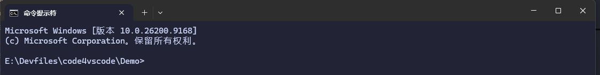
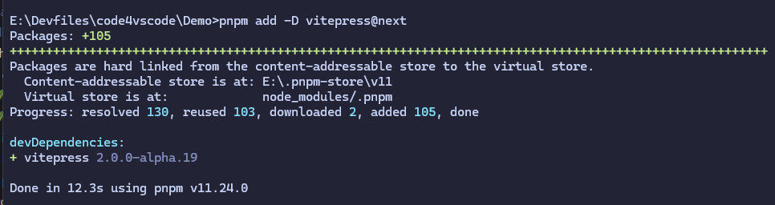
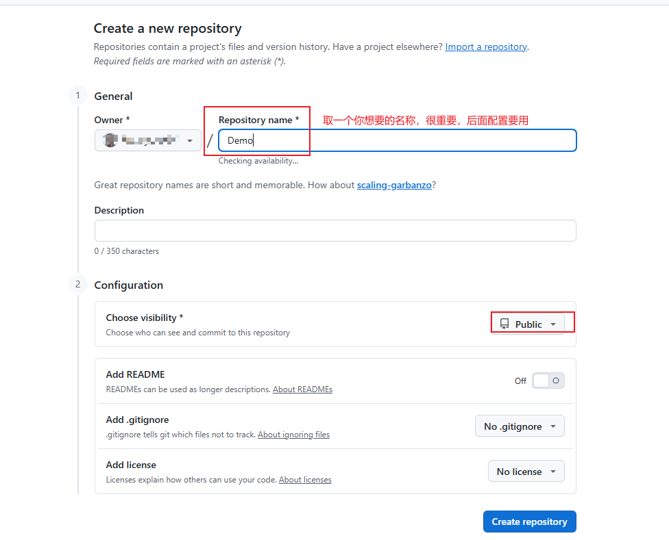
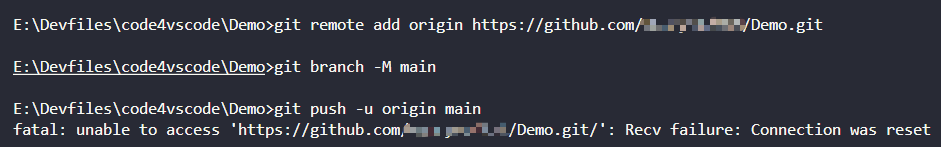
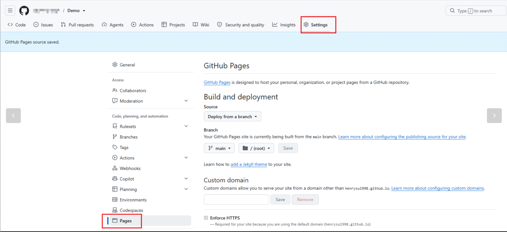
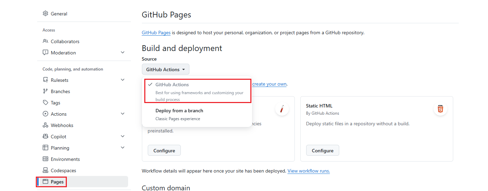
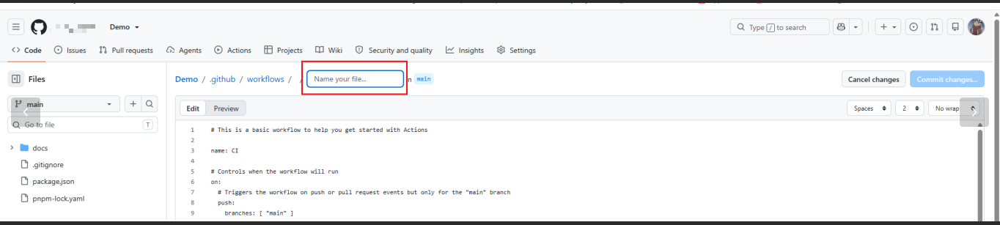
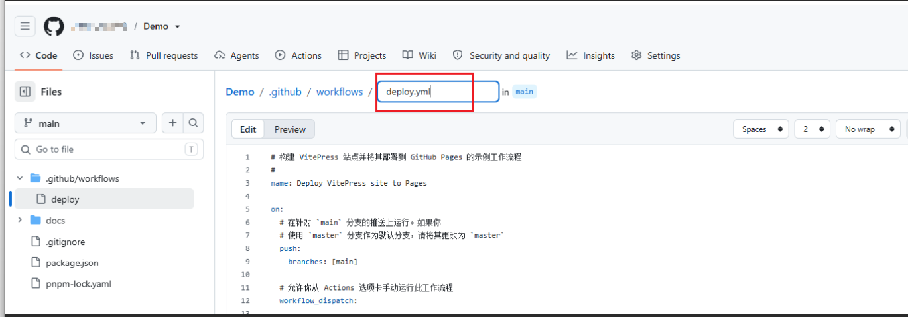
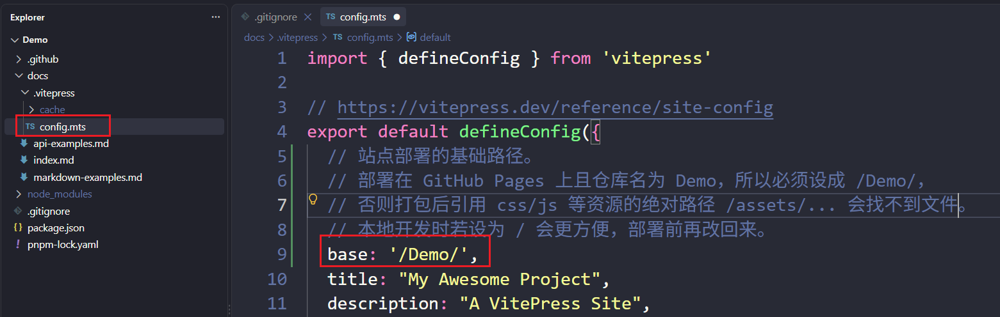
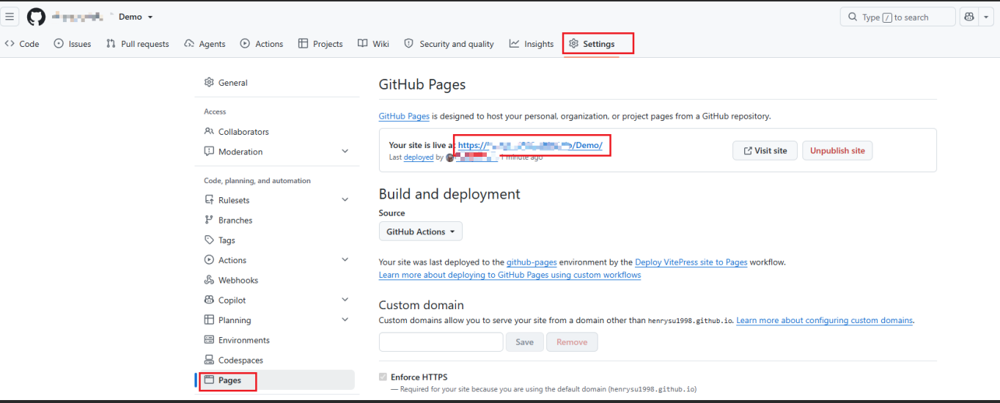

# VitePress初始化及GitHub Page部署教程


## 下载环境
根据官方文档安装对应的Node.js环境


## 安装VitePress

### 下载VitePress包
在你想要的位置创建文件，然后通过CMD打开：


在终端使用npm或者pnpm命令进行安装：
* 如果要使用 pnpm，需要先
```bash title="npm"
npm install -g pnpm
```

::: code-group

```bash [npm]
npm add -D vitepress@next
```

```bash [pnpm]
pnpm add -D vitepress@next
```
:::

完成下载，如下图



### 初始化VitePress项目
::: code-group

```bash [npm]
npx vitepress init
```

```bash [pnpm]
pnpm vitepress init
```
:::

根据安装向导，会回答几个问题：
```bash
┌  Welcome to VitePress!
│  
|  VitePress 的配置文件位置 
◇  Where should VitePress initialize the config?
│   ./docs
│   
|  VitePress 的markdown文件读取位置 
◇  Where should VitePress look for your markdown files?
│   ./docs
│
|  网站点名称（显示在浏览器标签页、导航栏顶部）
◇  Site title:
│   My Awesome Project
│
|  网站描述（用于搜索引擎展示和分享到微信/QQ 时的摘要）
◇  Site description:
│   A VitePress Site
│
|  主题：用官方默认主题（带导航栏、侧边栏、深色模式那套）
◇  Theme:
│   Default Theme
│
|  配置文件用 TS（生成 config.mts、.vue 组件的 lang="ts"）而不是 JS
◇  Use TypeScript for config and theme files?
│   Yes
│     
|  在 package.json 里自动加上常用的命令脚本（开发、构建、预览）
◇  Add VitePress npm scripts to package.json?
│   Yes
│  
|  这些脚本加个前缀。你填了 docs，所以生成的是：
|  docs:dev      # 本地开发预览
|  docs:build    # 打包构建
|  docs:preview  # 本地预览打包结果
◇  Add a prefix for VitePress npm scripts?
│   Yes
◇  Prefix for VitePress npm scripts:
│   docs
│
└  Done! Now run pnpm run docs:dev and start writing.
```

到此就安装完成啦！


## 部署到GitHub Page

### 创建GitHub仓库

这里是要推送的远程仓库

### 创建本地Git仓库
把刚刚安装VitePress文件夹，变为本地Git仓库


注意：init后，添加.gitignore文件，排除以下文件
```
node_modules
docs/.vitepress/cache
docs/.vitepress/dist
```

然后`git add .`添加全部文件，再`git commit -m "第一次提交"`

## 绑定远程仓库
通过`git remote add origin 仓库名称` 绑定远程仓库
通过`git branch -M main` 设置本地主分支名称
通过`git push -u origin main` 推送到远程的main分支


注意：如果你遇到和我一样的报错信息
（1）开启`科学上网`，然后根据提示登陆github账号授权
（2）通过在本地生成SSH key，然后将公钥Pub上传到github setting的SSH and GPG keys

## 配置GitHub Page
（1）在GitHub具体仓库`如本次的Demo`的Setting处，找到Pages，更改Build and deployment下的Source为GitHub Actions，点击create your own，会自动跳转到部署workflow配置界面。



（2）在 <https://vitepress.dev/zh/guide/deploy>，复制GitHub Pages部署文件，然后到GitHub的.github/workflows创建deploy.yml。
注意：我使用的是pnpm构建，所以jobs当中的配置和官网不同，不过官网的配置文件的注释中给了对应写法

```yaml
# 构建 VitePress 站点并将其部署到 GitHub Pages 的示例工作流程
#
name: Deploy VitePress site to Pages

on:
  # 在针对 `main` 分支的推送上运行。如果你
  # 使用 `master` 分支作为默认分支，请将其更改为 `master`
  push:
    branches: [main]

  # 允许你从 Actions 选项卡手动运行此工作流程
  workflow_dispatch:

# 设置 GITHUB_TOKEN 的权限，以允许部署到 GitHub Pages
permissions:
  contents: read
  pages: write
  id-token: write

# 只允许同时进行一次部署，跳过正在运行和最新队列之间的运行队列
# 但是，不要取消正在进行的运行，因为我们希望允许这些生产部署完成
concurrency:
  group: pages
  cancel-in-progress: false

jobs:
  # 构建工作
  build:
    runs-on: ubuntu-latest
    steps:
      - name: Checkout
        uses: actions/checkout@v5
        with:
          fetch-depth: 0 # 如果未启用 lastUpdated，则不需要
      - uses: pnpm/action-setup@v4 # 如果使用 pnpm，请取消此区域注释
        with:
         version: 11
      # - uses: oven-sh/setup-bun@v1 # 如果使用 Bun，请取消注释
      - name: Setup Node
        uses: actions/setup-node@v6
        with:
          node-version: 24
          cache: pnpm # 或 npm / yarn
      - name: Setup Pages
        uses: actions/configure-pages@v4
      - name: Install dependencies
        run: pnpm install # 或npm ci / yarn install / bun install
      - name: Build with VitePress
        run: pnpm docs:build # 或 npm run docs:build / yarn docs:build / bun run docs:build
      - name: Upload artifact
        uses: actions/upload-pages-artifact@v3
        with:
          path: docs/.vitepress/dist

  # 部署工作
  deploy:
    environment:
      name: github-pages
      url: ${{ steps.deployment.outputs.page_url }}
    needs: build
    runs-on: ubuntu-latest
    name: Deploy
    steps:
      - name: Deploy to GitHub Pages
        id: deployment
        uses: actions/deploy-pages@v4
```
（3）git pull拉取远程最新配置
（4）在config.mts，修改defineConfig的base部署节点

（5）在本地git add和git commit后，git push到推送远程分支
（6）然后就可以访问了，路径在pages中


## VitePress文件结构
```bash
.
├─ package.json                ← ① 项目配置文件
└─ docs/                       ← ② 站点源码目录
   ├─ .vitepress/              ← ③ 配置目录（固定叫这个名字）
   │  └─ config.mts            ← ④ 全局配置文件
   ├─ api-examples.md          ← ⑤ 一篇文章页
   ├─ markdown-examples.md     ← ⑥ 一篇文章页
   └─ index.md                 ← ⑦ 首页
```

**package.json** 

项目的「身份证 + 使用说明书」。记录：
  - 项目名字、版本
  - 依赖：装了 vitepress、vue 等
  - 脚本：docs:dev（开发）、docs:build（构建）、docs:preview（预览）

**docs文件夹**

- Markdown文件存放点，所有.md 文件都放这里，每个.md 自动对应一个页面：
  - api-examples.md → /api-examples
  - markdown-examples.md → /markdown-examples
  - index.md → /（首页）
  - VitePress 使用 基于文件的路由：每个 .md 文件将在相同的路径被编译成为 .html 文件
- docs/.vitepress/：
  - VitePress 规定配置必须放在叫 .vitepress 的文件夹里。它里面存放 config、主题、数据加载器等，这些文件不会生成页面。
- docs/.vitepress/config.mts：
  - 整站的设置,站点标题（「橘子不爱吃番茄酱」）
  - base: '/CraftBlog/'（部署路径）
  - 导航栏、侧边栏、社交图标
- api-examples.md / markdown-examples.md：
  - 示例文章页
- index.md：
  - 首页,frontmatter 里写着 layout: home 和 hero 信息，渲染成你看到的大标题页.
